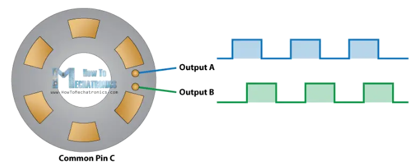

# I/O Board - ATSAMD21G18-A

---

This repository contains the hardware and software components of the I/O board for the Chameleon project.
The goal for this portion of the project is to create a peripheral to control [YASE](https://github.com/klavins/YASE). It can interface with any CPU using the I2C bus, and will allow users to modify parameters in YASE. The I/O board has rotary encoders, switches, and LEDs that the user can configure using I2C commands.

---

## Hardware

#### Rotary Encoders
To allow users to modify YASE parameters with a knob, we are using rotary encoders. While rotary encoders may appear visually similar to a potentiometer you may find on a guitar or analog synthesizer module, they are fundamentally different. Instead of behaving like a variable resistor, rotary encoders are more similar to a rotary, dual-pole, dual-throw switch. Rotary encoders also spin indefinitely and do not have a start and end like a potentiometer.

The [How To Mechatronics](https://howtomechatronics.com/tutorials/arduino/rotary-encoder-works-use-arduino/) website has a great tutorial and explanation for how rotary encoders work.

A rotary encoder has 3 pins. The middle pin (C) is a shared power pin, which is connected to a power source. As the encoder spins, a brush powered by the middle pin makes contact with the left (A) and right (B) pins in sequence.



Since A and B are sent high at slightly different times, we can determine the direction of spin by measuring the state of A and B when a change in one is detected. This task is surprisingly simple to code.
Initially, we sample the value of `A` as value `aLast`. In a loop, we check to see if `aLast == A`. If `A != aLast`, we check the value of `B`. If `B == A`, we know `B` changed before `A` and the knob has been turned to the left. If `B != A`, then we know `A` changed first and the knob was turned to the right. Sample C code for managing one encoder is shown below.

```C
uint8_t encVal = 0;
_Bool aLast = A;
while(1) {
  if (A != aLast) {
    if(A != B) {
      encVal++;
    } else {
      encVal--;
    }
  }
  aLast = A;
}
```

I chose to use the PEC12R-3217F-S0024-ND rotary encoders because other similar projects used them. They include an extra switch that goes high when you press down on the knob. As an added bonus, they make a very satisfying clicking sound when pressed.

#### Microcontrollers

The state of the encoders, LEDs, and switches are managed by a microprocessor. Initially I prototyped using the Arduino UNO, due its ease of use. However, the ATMEGA328P microcontroller it uses does not have enough GPIO to support the amount of peripherals we decided to use.

We have 4 rotary encoders, 4 switches, and 4 LEDs. Each encoder uses 3 GPIO (2 for the encoder and one for the pushbutton switch). Each switch and LED uses one GPIO. On top of this, I need two pins for accessing the I2C bus. This totals 22 GPIO. I could have used two microcontrollers, however choosing one that has enough GPIO to begin with seemed like a smarter idea so that I wouldn't have to write two separate programs.

This GPIO requirement led me to the ATSAMD21G18, an ARM-based microcontroller used on the Arduino Zero. This microprocessor is honestly way more powerful than we will take advantage of, but they are relatively cheap, widely available, and have more than enough GPIO. This will allow expansion in the future if a different team decides they want to add something else!

#### PCB Design

The biggest design consideration made for the PCB was making it compatible with other Eurorack modules. Eurorack modules have the following size constraints:
- Height - 128.5mm/5.06"
- Width - in increments of 0.2", called a Horizontal Pitch (HP)
- Mounting holes - 3.2mm diameter
- Left mounting holes aligned 3mm from top and bottom edge, and 7.45mm from the left edge
- Right mounting holes aligned in HP increments from the left holes

For the IO board, I chose a width of 15HP. I found this size to be a good width for fitting all the components we needed. The mounting holes are 13HP apart, as this way there was plenty of clearance from the hole to right edge.


I placed the rotary encoders, LEDs, and switches on a grid of 0.1" so that I could make them symmetrical across the middle of the board. I used a smaller grid for the ATSAMD21G18 and bypass capacitors to make routing easier. The ATSAMD21G18 has both internal pull up and pull down resistors, so there was no need to include extra resistors on the board, except for the resistors used for the LEDs. I found 10k ohms to yield a good brightness for the LEDs in testing.

For power, I am using a 3.3v LDO. I chose this instead of stealing power from the main computer in hopes that it may be a little more stable and allow for  expansion in the future.

The entire back copper layer of my PCB is a ground plane. This makes it very easy to ground anything that I need by placing a via. Once all of my components were connected to the ATSAMD21G18, I made the rest of the front copper layer a +3.3v power plane. This meant I did not have to route any power traces on the board, vastly simplifying the amount of time it took to design the PCB.

The switches are single throw, dual pole. This choice was made largely because they are much cheaper than single throw, single pole switches and readily available. I connected the middle pin to power, and the top pin to the SAM's GPIO.
