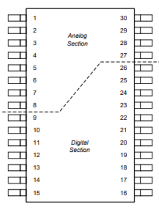
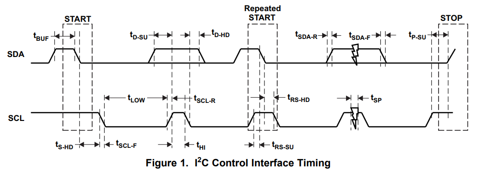
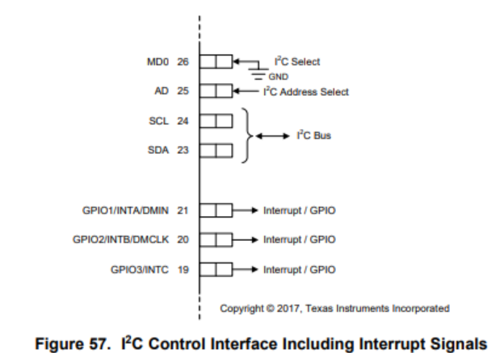

# PCM1863 ADC
The [PCM1863](https://www.ti.com/product/PCM1863?utm_source=google&utm_medium=cpc&utm_campaign=asc-null-null-GPN_EN-cpc-pf-google-wwe&utm_content=PCM1863&ds_k=PCM1863&DCM=yes&gclid=Cj0KCQiA6fafBhC1ARIsAIJjL8l6Lk9SO-Q0-fB0_5uYiveTayMeogbHzMJUxCBsQcNd4n_-5XY2ie4aAl2cEALw_wcB&gclsrc=aw.ds) is an audio-controlled analog-to-digital (ADC) converter. The chip is 110dB 2-channel software controlled. The chip is made by Texas Instruments (TI), and its datasheet is available here: [PCM1863 Datasheet](https://www.ti.com/lit/ds/symlink/pcm1861-q1.pdf?HQS=dis-dk-null-digikeymode-dsf-pf-null-wwe&ts=1676585219889&ref_url=https%253A%252F%252Fwww.ti.com%252Fgeneral%252Fdocs%252Fsuppproductinfo.tsp%253FdistId%253D10%2526gotoUrl%253Dhttps%253A%252F%252Fwww.ti.com%252Flit%252Fgpn%252Fpcm1861-q1).

The chip is a TSSOP (DBT) 30 pin package.

Drivers for the PCM 186x series are available [here](https://e2e.ti.com/support/audio-group/audio/f/audio-forum/773056/faq-linux-drivers-device-drivers-for-aic31xx-dac31xx-aic325x-aic320x-aic326x-aic321x). More driver information can be found on the [TI webpage](https://www.ti.com/product/PCM1863?utm_source=google&utm_medium=cpc&utm_campaign=asc-null-null-GPN_EN-cpc-pf-google-wwe&utm_content=PCM1863&ds_k=PCM1863&DCM=yes&gclid=Cj0KCQiA6fafBhC1ARIsAIJjL8l6Lk9SO-Q0-fB0_5uYiveTayMeogbHzMJUxCBsQcNd4n_-5XY2ie4aAl2cEALw_wcB&gclsrc=aw.ds) for the PCM1863.

---

In our project, we are using the PCM1863 as an analog-to-digital (ADC) converter. The goal of the chip is to take analog input, and change the signal into a readable I2C output.

### Inputs (mono only):
- Control voltage (CV) at 5V.
- 3.5mm Headphone jack.
- Guitar or bass (through adapter into a 3.5mm jack)

## Outputs:
- Digital I2C signal
- Other configurable outputs are not used for our project.

---
# PCB Creation:
Our ADC board centers around the PCM1863, but contains other peripherals. This section will discuss the design decisions for the PCM1863 and peripherals.

Here is the current KiCad 3D model for our PCB: 

Here is the current KiCad schematic for our PCB: 

## The PCM1863 chip:
The PCM1863 has 30 pins. 

**Of the 30 pins, 12 are analog and 18 are digital.** The chip is split into a digital and an analog part so the noisy digital powers and signals do not interfere with the sensitive analog signals. 

---

### Example layouts:
Below are several example circuits given in the Ti datasheet:

---
### PCM1863 Pins and components:
This section will detail decisions made regarding the components connected to the PCM1863.

**Vin:**
The PCM1863 is able to handle 4-channels of analog inputs. There is a right and a left for each input. We are using mono not stereo audio

### PCM1863 Pinout:
**1  - VINL2/VIN1M:** Analog input 2, L-channel (or differential M input for input 1)

**2  - VINR2/VIN2M:** Analog input 2, R-channel (or differential M input for input 2)

**3  - VINL1/VIN1P:** Analog input 1, L-channel (or differential P input for input 1)

**4  - VINR1/VIN2P:** Analog input 1, R-channel (or differential P input for input 2)

**5  - Mic Bias:** Microphone biased output
- # TODO: why 2.6V and 4mA recommended

**6  - VREF:** Reference voltage output decoupling point (typically, 0.5 AVDD)
- Connect 1-µF capacitor from this pin to AGND.

**7  - AGND:** Analog ground

**8  - AVDD:** Analog power supply (typically, 3.3 V)
- Connect 0.1-µF and 10-µF capacitors from this pin to AGND.

**9  - XO:** Crystal oscillator output

**10 - XI:** Crystal oscillator input or master clock input (1.8-V CMOS signal)

**11 - LDO:** Internal low-dropout regulator (LDO) decoupling output
- Connect 0.1-µF and 10-µF capacitors from this pin to DGND.
- Can connect external 1.8V input to bypass LDO, and put the device in power saving mode.

**12 - GDND:** Digital ground

**13 - DVDD:** Digital power supply (typically, 3.3 V)
-  Connect 0.1-µF and 10-µF capacitors from this pin to DGND.

**14 - IOVDD:** Power supply for I/O voltages (typically, 3.3 V or 1.8 V)
- Connected to DVDD (3.3V)
- # TODO Do I want to connect this to LDO to get 1.8V power for I/O components?

**15 - SCKI:** CMOS level (3.3 V) master clock input

**16 - LRCK:** Audio data word clock (left right clock) input/output
- Schmitt trigger input has an internal pull-down of 50kOhms

**17 - BCK:** Audio data bit clock input/output
- Schmitt trigger input has an internal pull-down of 50kOhms

**18 - DOUT:** Audio data digital output

**19 - GPIO3/INTC:** GPIO 3 or interrupt C

**20 - GPIO2/INTB/DMCLK:** GPIO 2, interrupt B, or digital microphone clock output

**21 - GPIO1/INTA/DMIN:** GPIO 1, interrupt A, or digital microphone input

**22 - MISO/GPIO0/DMIN2:** In I2C mode: *GPIO0*
- Chip is set to I2C not SPI mode.

**23 - MOSI/SDA:** In I2C mode: *SDA*
- Chip is set to I2C not SPI mode.

**24 - MC/SCL:** Serial bit clock

**25 - MS/AD:** In I2C mode: *address pin*
- Chip is set to I2C not SPI mode.

**26 - MD0:** Control method select pin
- High = SPI
- Low (or unconnected) = I2C

**27  - VINL4/VIN4M:** Analog input 4, L-channel (or differential M input for input 4)

**28  - VINR4/VIN3M:** Analog input 4, R-channel (or differential M input for input 3)

**29  - VINL3/VIN4P:** Analog input 3, L-channel (or differential P input for input 4)

**30  - VINR3/VIN3P:** Analog input 3, R-channel (or differential P input for input 3)

### Chip ratings:
**AVDD:** 3.3V

**DVDD:** 3.3V

**IOVDD:** 3.3V

**XI:** 1.8V

**VIN:** -1.7V to 5.0V

**Current:** MAX of 31mA

**Power:** MAX of 117.3mW

### Timing requirements for I2C control interface:
The PCM1863 has two I2C modes: *fast and standard*. If one number is given, the number is the minimum acceptable value. If two values are given, they are given in the form [MIN, MAX] acceptable values. Both fast and standard modes follow the same timing constraints as show in the timing diagram:

***FAST MODE:***

**cB:** Capacitive load for SDA and SCL lines - MAX 400pF

**vNH:** Noise margin at high level for each connected device - 0.2VDD

**fSCL:** SCL clock frequency - MAX 400kHz

**tBUF:** Bus free time between STOP and START conditions - 1.3us

**tLOW:** Low period of the SCL clock - 1.3us

**tHI:** High period of the SCL clock - 600ns

**tRS-SU:** Setup time for repeated START condition - 600ns

**tS-HD:** Hold time for START condition - 600ns

**tRS-HD:** Hold time for repeated START condition - 600ns

**tD-SU:** Data setup time - 100ns

**tD-HD:** Data hold time - [0, 900ns]

**tSCL-R:** Rise time of SCL signal - [(20 + 0.1cB)ns, 300ns]

**tSCL-R1:** Rise time of SCL signal after a repeated START condition and after an acknowledge bit- [(20 + 0.1cB)ns, 300ns]

**tSCL-F:** Fall time of SCL signal - [(20 + 0.1cB)ns, 300ns]

**tSDA-R:** Rise time of SDA signal - [(20 + 0.1cB)ns, 300ns]

**tSDA-F:** Fall time of SDA signal - [(20 + 0.1cB)ns, 300ns]

**tP-SU:** Setup time for STOP condition - 600ns

**tSP:** Pulse duration of spike suppressed - MAX 50ns

---

***STANDARD MODE:***

**cB:** Capacitive load for SDA and SCL lines - MAX 400pF

**vNH:** Noise margin at high level for each connected device - 0.2VDD

**fSCL:** SCL clock frequency - MAX 100kHz

**tBUF:** Bus free time between STOP and START conditions - 4.7us

**tLOW:** Low period of the SCL clock - 4.7us

**tHI:** High period of the SCL clock - 4us

**tRS-SU:** Setup time for repeated START condition - 4.7us

**tS-HD:** Hold time for START condition - 4us

**tRS-HD:** Hold time for repeated START condition - 4us

**tD-SU:** Data setup time - 250ns

**tD-HD:** Data hold time - [0, 900ns]

**tSCL-R:** Rise time of SCL signal - [(20 + 0.1cB)ns, 1000ns]

**tSCL-R1:** Rise time of SCL signal after a repeated START condition and after an acknowledge bit- [(20 + 0.1cB)ns, 1000ns]

**tSCL-F:** Fall time of SCL signal - [(20 + 0.1cB)ns, 1000ns]

**tSDA-R:** Rise time of SDA signal - [(20 + 0.1cB)ns, 1000ns]

**tSDA-F:** Fall time of SDA signal - [(20 + 0.1cB)ns, 1000ns]

**tP-SU:** Setup time for STOP condition - 4us

**tSP:** Pulse duration of spike suppressed -  MAX 50ns

### PCM1863 Suggested landing pattern:
The Ti suggested landing pattern for the chip and its TSSOP30 package:

- 
- 

## Peripherals;
