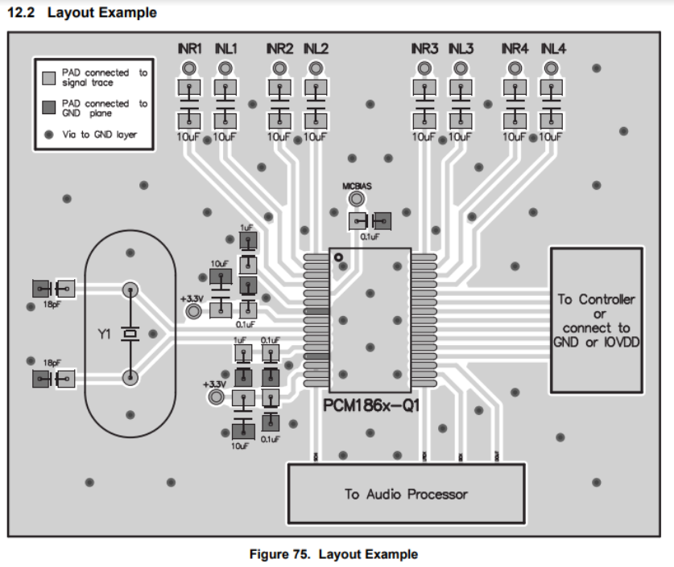

# PCM1863 ADC
The [PCM1863](https://www.ti.com/product/PCM1863?utm_source=google&utm_medium=cpc&utm_campaign=asc-null-null-GPN_EN-cpc-pf-google-wwe&utm_content=PCM1863&ds_k=PCM1863&DCM=yes&gclid=Cj0KCQiA6fafBhC1ARIsAIJjL8l6Lk9SO-Q0-fB0_5uYiveTayMeogbHzMJUxCBsQcNd4n_-5XY2ie4aAl2cEALw_wcB&gclsrc=aw.ds) is an audio-controlled analog-to-digital (ADC) converter. The chip is 110dB 2-channel software controlled. The chip is made by Texas Instruments (TI), and its datasheet is available here: [PCM1863 Datasheet](https://www.ti.com/lit/ds/symlink/pcm1861-q1.pdf?HQS=dis-dk-null-digikeymode-dsf-pf-null-wwe&ts=1676585219889&ref_url=https%253A%252F%252Fwww.ti.com%252Fgeneral%252Fdocs%252Fsuppproductinfo.tsp%253FdistId%253D10%2526gotoUrl%253Dhttps%253A%252F%252Fwww.ti.com%252Flit%252Fgpn%252Fpcm1861-q1).

The chip is a TSSOP (DBT) 30 pin package.

Drivers for the PCM 186x series are available [here](https://e2e.ti.com/support/audio-group/audio/f/audio-forum/773056/faq-linux-drivers-device-drivers-for-aic31xx-dac31xx-aic325x-aic320x-aic326x-aic321x). More driver information can be found on the [TI webpage](https://www.ti.com/product/PCM1863?utm_source=google&utm_medium=cpc&utm_campaign=asc-null-null-GPN_EN-cpc-pf-google-wwe&utm_content=PCM1863&ds_k=PCM1863&DCM=yes&gclid=Cj0KCQiA6fafBhC1ARIsAIJjL8l6Lk9SO-Q0-fB0_5uYiveTayMeogbHzMJUxCBsQcNd4n_-5XY2ie4aAl2cEALw_wcB&gclsrc=aw.ds) for the PCM1863.

---

In our project, we are using the PCM1863 as an analog-to-digital (ADC) converter. The goal of the chip is to take analog input, and change the signal into a readable I2C output.

### Inputs (mono only):
- Control voltage (CV) at 5V.
- 3.5mm Headphone jack.
- Guitar or bass (through adapter into a 3.5mm jack)

## Outputs:
- Digital I2C signal
- Other configurable outputs are not used for our project.

---
# PCB Creation:
Our ADC board centers around the PCM1863, but contains other peripherals. This section will discuss the design decisions for the PCM1863 and peripherals.

Here is the current KiCad 3D model for our PCB: 

Here is the current KiCad schematic for our PCB: 

## The PCM1863 chip:
The PCM1863 has 30 pins. 

**Of the 30 pins, 12 are analog and 18 are digital.** The chip is split into a digital and an analog part so the noisy digital powers and signals do not interfere with the sensitive analog signals. 

---

### Example layouts:
Below are several example circuits given in the Ti datasheet:

---
### PCM1863 Pins and components:

### PCM1863 Suggested landing pattern:
The Ti suggested landing pattern for the chip and its TSSOP30 package:

- 
- 

## Peripherals;
