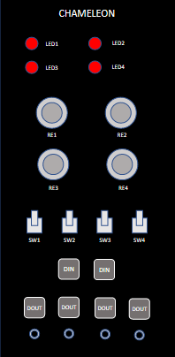

# chameleon-PCB
This repo documents the University of Washington ENGINE 2023 Chameleon Team's journey to creating a digital, modular synthesizer - a **Chameleon**. The team consists of Todd Bloom, Max Chastain, Nathan Ford, Julian James, and Trina Kha. The mentor for the project is Eric Klavins.

Eric Klavins hosts a GitHub repo with the software used for the project. The software is Yet Another Synthesizer Engine (YASE). Links to relevant repos are provided below.

[yase](https://github.com/klavins/yase.git): The synthesizer engine used in the project.

[yase-template](https://github.com/klavins/yase-template.git): The template makefile to be used when installing YASE.

[potato-recipies](https://github.com/klavins/potato-recipies.git): Instructions on how to install and use YASE on Le Potato (an alternate board similar to a Raspberry Pi).

[arty-z7-20-recipies](https://github.com/klavins/arty-z7-20-recipes.git): Instructions on how to install and use YASE on an ARTY-Z7-20 (an alternate board similar to a Raspberry Pi).

## Project Overview:

The Chameleon can function as a waveform generator, filter, effect, sequencer, and any other programmable module.

The **user interface** includes: *four LEDs, four rotary encoders, and four toggle switches.*

The **inputs** are: *Two stereo S/PDIF inputs* to take incoming data from other Chameleons and *two line-level mono-analog audio inputs.*

The **outputs** are: *Four stereo S/PDIF outputs* (carrying the same signal) that can be connected to other Chameleons and *two line-level mono-analog audio outputs.*

## Block Diagram:

